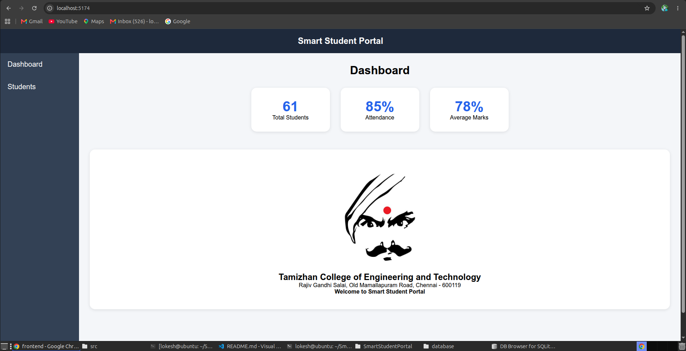
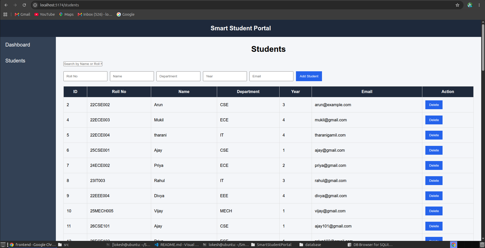

# React + Vite

This template provides a minimal setup to get React working in Vite with HMR and some ESLint rules.

Currently, two official plugins are available:

- [@vitejs/plugin-react](https://github.com/vitejs/vite-plugin-react/blob/main/packages/plugin-react) uses [Oxc](https://oxc.rs)
- [@vitejs/plugin-react-swc](https://github.com/vitejs/vite-plugin-react/blob/main/packages/plugin-react-swc) uses [SWC](https://swc.rs/)

## React Compiler

The React Compiler is not enabled on this template because of its impact on dev & build performances. To add it, see [this documentation](https://react.dev/learn/react-compiler/installation).

## Expanding the ESLint configuration

If you are developing a production application, we recommend using TypeScript with type-aware lint rules enabled. Check out the [TS template](https://github.com/vitejs/vite/tree/main/packages/create-vite/template-react-ts) for information on how to integrate TypeScript and [`typescript-eslint`](https://typescript-eslint.io) in your project.
# 🎓 Smart Student Portal

A modern and responsive **Student Management System** built using **React.js**, **Vite**, **HTML**, **CSS**, and **JavaScript**. This application provides an interactive interface for managing student records and monitoring academic information.

## 🚀 Features

* 📊 Dashboard with student statistics
* 👨‍🎓 View all students
* ➕ Add new students
* 🔍 Search students by Name or Roll Number
* ❌ Delete students
* 🧭 Sidebar navigation using React Router
* 🏫 College information section
* 📱 Responsive user interface

---

## 🛠️ Technologies Used

* React.js
* Vite
* HTML5
* CSS3
* JavaScript (ES6)
* React Router DOM
* JSON

---

## 📂 Project Structure

```text
frontend/
│
├── public/
│
├── src/
│   ├── assets/
│   │   ├── bharathiyar.jpg
│   │   ├── hero.png
│   │   ├── react.svg
│   │   └── vite.svg
│   │
│   ├── components/
│   │   ├── Navbar.jsx
│   │   └── Sidebar.jsx
│   │
│   ├── pages/
│   │   ├── Dashboard.jsx
│   │   └── Students.jsx
│   │
│   ├── data/
│   │   └── students.json
│   │
│   ├── App.jsx
│   ├── App.css
│   ├── index.css
│   └── main.jsx
│
├── package.json
├── vite.config.js
└── README.md
```

---

## 📸 Screenshots

### Dashboard Page



### Students Page



### College Logo 

<p align="center">
  
</p>

---

## ⚙️ Installation

Clone the repository:

```bash
git clone https://github.com/your-username/SmartStudentPortal.git
```

Go to project folder:

```bash
cd SmartStudentPortal/frontend
```

Install dependencies:

```bash
npm install
```

Run the project:

```bash
npm run dev
```

Open browser:

```text
http://localhost:5173
```

---

## 📋 Dashboard Statistics

* Total Students
* Attendance Percentage
* Average Marks

---

## 👨‍🎓 Student Management

Users can:

* Add Student
* Delete Student
* Search Student
* View Student Details

---

## 🌟 Future Enhancements

* Edit Student Details
* SQLite Database Integration
* User Authentication
* Attendance Management
* Marks Management

---

## 👨‍💻 Author

**Lokeshwaran K**

B.E

Frontend Developer | React.js | C  | SQL | Linux

---

## 📜 License

💡 This project is developed for educational and learning purposes. Users and developers are encouraged to clone the project, explore the source code, and enhance it by adding advanced and interactive features.


<h1 align="center">
🚀 Happy Coding and Good Luck! 🚀
</h1>